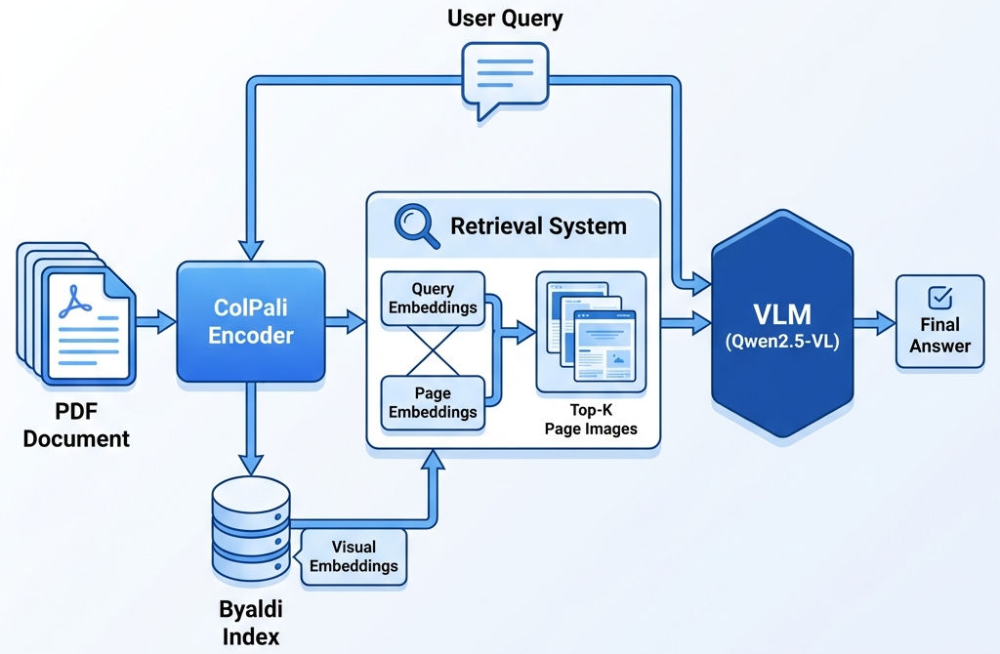

# プロジェクト 5: マルチモーダル RAG エンタープライズ財務レポート アシスタント

> **範囲**: Capstone プロジェクト - 複雑なドキュメント (チャート、テーブル) 検索の課題を解決する

### 1. プロジェクトの背景 (プロジェクトの概要)

- **タスク定義:** 企業の年次報告書の複雑なチャートやデータ テーブルを「理解」できる RAG システムを構築し、ビジュアル検索 (Visual Retrieval) とマルチモーダル LLM (VLM) を通じて財務報告書に関する詳細な Q&A を実現します。
- **入力と出力:**
  - **入力:** PDF 形式の企業年次財務報告書 (混合レイアウトのテキスト、クロスページ表、傾向折れ線グラフ、円グラフなどを含む)。
  - **出力:** チャート データの傾向と特定の値に基づいた自然言語分析の回答。
- **課題分析:** 
  1. **構造の損失**: 従来の RAG はテキストに対して OCR を使用するため、テーブルの行と列の対応が簡単に失われ、テキスト キャプションのない傾向グラフをまったく処理できません。
  2. **セマンティックな断片化**: レポートには「下の図を参照」という参照が含まれることがよくあります。テキストとグラフが分離されていると、検索の切り捨てが発生します。
  3. **検索ノイズ**: 目次ページにはキーワードが含まれることが多く、誤った想起を引き起こしやすく、コンテキスト ウィンドウが混雑します。

### 2. アーキテクチャ設計 (アーキテクチャ設計)

このプロジェクトの核となるコンセプトは **「ViR (Vision in Retrieval) + VLM (Vision Language Model)」です。** PDF を強制的にテキスト化することはもうありません。代わりに **ColPali** を使用して、各 PDF ページを視覚的エンコード用の画像として扱い、視覚的特徴を直接取得し、取得した画像をマルチモーダル LLM に供給して解釈します。

### データパイプライン図




### テクノロジースタック

|コンポーネント |ツール/モデル |選択理由 |
| :--- | :--- | :--- |
| **視覚検索モデル** | **ColPali (v1.2)** |現在の SOTA ドキュメント検索モデル。 PaliGemma に基づく。ページ レイアウト、フォント サイズ、グラフの視覚的特徴を理解します。 OCRは必要ありません。 |
| **インデックス フレームワーク** | **ビヤルディ** | ColPali 軽量ラッパー。マルチモーダル モデル テンソルの保存と取得フローを簡素化します。 |
| **マルチモーダル LLM** | **Qwen2.5-VL-72B** | Alibaba Tongyi Qianwen 最新ビジョンモデル;チャートの理解 (ChartQA) と文書の解析 (DocVQA) に優れています。 |


### 3. 段階的な実装

### フェーズ 1: ビジュアル インデックスの構築 (ビジュアル インデックス作成)

従来の RAG の `Chunking -> Embedding` とは異なり、ここでは `Page -> Screenshot -> Visual Embedding` を実行します。

**キー コード ロジック (`index.py`):**

```python
from byaldi import RAGMultiModalModel

# 1. Load local ColPali model (solves HuggingFace connection issues)
MODEL_PATH = "/path/to/models/colpali-v1.2-merged"
INDEX_NAME = "finance_report_2024"

def build_index():
    # 2. Initialize model (supports load_in_4bit for memory reduction)
    RAG = RAGMultiModalModel.from_pretrained(MODEL_PATH, verbose=1)
    
    # 3. Build index
    # Principle: Byaldi converts PDF to images, computes visual vectors and stores
    RAG.index(
        input_path="annual_report_2024.pdf",
        index_name=INDEX_NAME,
        store_collection_with_index=True, # Must store original image references
        overwrite=True
    )
```

**実践上の注意事項:**
* **デバッグ:** 最初の実行で OOM (メモリ不足) が発生しました。
* **解決策:** ColPali フルバージョンには最大 10GB 以上のメモリが必要です。不足する場合は、`load_in_4bit=True` を `from_pretrained` に追加します。

### フェーズ 2: 複数ページの視覚的検索 (複数ページの検索)

財務レポート Q&A の典型的な落とし穴: **キーワード「営業成績」は目次にも表示されます。** トップ 1 のみを取得する場合、目次のみが取得される可能性があり、モデルが応答できない可能性があります。したがって、戦略では、Top-K (3 ～ 5 ページを推奨) を取得してフィルターする必要があります。

**キー コード ロジック (`rag_chat.py` - 取得部分):**

```python
# Load index
RAG = RAGMultiModalModel.from_index(INDEX_NAME)

# Increase retrieval pages to prevent only hitting table of contents
RETRIEVAL_K = 4 

results = RAG.search(user_query, k=RETRIEVAL_K)

# Results contain: page_num (page number), base64 (image data), score (relevance)
```

### フェーズ 3: マルチイメージ コンテキストの生成 (マルチイメージの生成)

取得した K 個の画像すべてをコンテキストとして VLM に供給し、モデルのロング ウィンドウとマルチ画像機能を活用して包括的な分析を行います。

**キー コード ロジック (`rag_chat.py` - 生成部分):**

```python
# Build multimodal payload
content_payload = []

# 1. System Prompt: Define role and anti-interference instructions
content_payload.append({
    "type": "text", 
    "text": f"You are a professional CFO assistant... may contain table of contents, please ignore table of contents, directly answer based on pages with specific data..."
})

# 2. Inject multiple images
for res in results:
    content_payload.append({
        "type": "image_url",
        "image_url": {
            "url": f"data:image/jpeg;base64,{res.base64}", 
            "detail": "high" # Enable high-res mode for small text recognition
        }
    })

# 3. Send to Qwen2.5-VL-72B
response = client.chat.completions.create(
    model="Qwen/Qwen2.5-VL-72B-Instruct",
    messages=[{"role": "user", "content": content_payload}],
    temperature=0.1 # Maintain factuality
)
```

### 4. 結果ショーケース (ショーケース)

以下は、Huawei 2024 財務報告書におけるシステムの実際の実行記録です。目次を省略し、49ページ、91ページ、130ページ、8ページの情報を統合し、研究開発投資や無形資産の変動を定量的に分析することに成功しました。

```text
>>> Please ask: How are the operating results?

🔍 Retrieving Top-4 relevant pages...
📄 Hit pages: [49] [91] [130] [8]
🚀 Sending to LLM for comprehensive analysis...

🤖 Financial Report Assistant Answer:
----------------------------------------
Based on the provided financial report screenshots, operating results can be analyzed from the following aspects:

### 1. **R&D and Innovation Investment**
- **R&D Expenses**: In 2024, R&D expenses were RMB 179.7 billion, accounting for 20.8% of annual revenue. Cumulative R&D investment over the past decade exceeded RMB 1,249 billion. This indicates continued substantial investment in R&D and innovation,committed to technology breakthrough and product upgrade.
- **R&D Personnel**: As of December 31, 2024, R&D employees numbered approximately 113,000, accounting for 54.1% of total employees, showing company emphasis on R&D team and sustained innovation investment.

### 2. **Intangible Assets**
- **Goodwill and Intangible Assets**: Screenshots show detailed data on goodwill, software, patents and royalties, trademark rights, and other intangible assets. From 2023 to 2024, goodwill increased from 4,424 to 4,496 million yuan... (abbreviated) ...indicating continued growth in intangible assets.

### 3. **Corporate Social Responsibility and Sustainable Development**
- **Tech Classroom Project**: Huawei officially launched "Tech Classroom" project... (abbreviated)
- **Mobile Digital Classroom Project**: Huawei partnered in Kenya for DigiTruck project...

### 4. **Chairman's Message**
- **Strategic Focus and Continued Innovation**: Chairman noted in message that 2024 was a challenging year; Huawei employees remained confident and proactive, achieving business development goals with overall operations meeting expectations...

In summary, Huawei's 2024 operating results were outstanding, with significant achievements in R&D and innovation, intangible assets, corporate social responsibility and sustainable development.
----------------------------------------
```

### 5. コストと最適化 (コストと最適化)

- **リソース消費量:**
  - **インデックス コスト:** ColPali の処理が遅い (~0.5 秒/ページ)。 200 ページのレポートのインデックス作成には 2 ～ 3 分かかります。
  - **推論コスト:** マルチモーダル トークンの消費量は膨大です。 1 つの 1024x1024 画像 ≈ 1000 ～ 1500 トークン。各トップ 4 の取得は、少なくとも 5000 以上の入力トークンを意味します。 Qwen2.5-VL-72B の SiliconFlow API を使用すると、1 回の Q&A コストは約 0.05 ～ 0.1 RMB です。

- **最適化のアイデア:**
  1. **精度の最適化:** 超高解像度の財務表の場合、インデックス作成前に PDF ページを「トリミング」できます。1 つの大きな画像を 4 つの小さな画像に分割して個別のインデックスを作成し、ローカル検索の明瞭さを向上させます。
  2. **画像のトリミング:** ColPali は関連領域を見つけることができます (パッチレベルの取得)。 future では、ページからフィード LLM まで関連する「チャート領域」のみをトリミングできるため、トークンの消費が大幅に削減されます。
  3. **キャッシュ メカニズム:** 「収益額」や「純利益額」などの固定の高頻度質問については、視覚的な推論の繰り返しを避けるために VLM 解析結果をキャッシュします。
