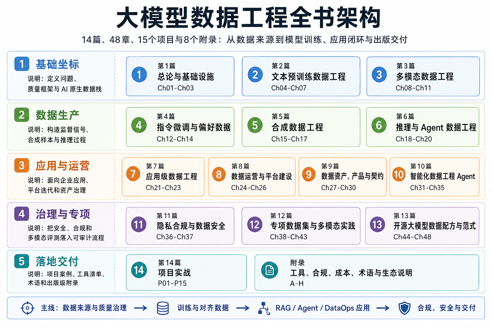

# 序言

在当下大模型迅速发展的时代，数据已成为决定模型能力上限的关键因素。无论是文本、图像、视频还是音频，多模态数据的获取、清洗与加工都直接影响模型的表现。面对庞大的网页语料、公共语料库和行业文档，我们必须设计高效的流水线，将原始、杂乱的数据转化为高质量、可供模型学习的训练样本。数据处理的每一个环节——从网页抓取、HTML 解析，到文本去噪、去重、分词与序列化，再到视频帧切分、音视频同步、多模态对齐与标注——都充满挑战，同时也决定了训练效果的优劣。

本书以“数据工程”为核心，系统梳理了大模型训练中从数据获取到数据生成的完整流程。书中深入讲解高性能分布式数据流水线的设计，解析异构硬件下的任务调度、存储优化和性能诊断方法。通过对指令微调数据、偏好对齐数据、合成教科书级数据以及多模态指令数据的构建，展示如何在保证数据质量与逻辑严密性的前提下，组织和管理大规模、高复杂度训练样本。同时，本书也涵盖面向实际应用的检索增强生成系统与企业级多模态问答系统设计，力求建立从理论方法到工程实践的完整链路。

在每一章节中，作者以案例驱动的方式展示实际工程实践，剖析数据流水线设计的关键技术细节，以及在处理海量数据时的工程策略与经验总结。读者不仅可以理解大模型训练所需数据的复杂性，还能够掌握构建可扩展、高效、可复现的数据工程体系的方法。通过学习和实践这些方法，研究者和工程师可以更有效地支撑大模型的训练和应用，提升模型在文本理解、图像生成、视频分析及跨模态推理等任务中的能力。

本书旨在为大模型数据工程领域提供一部系统、全面、可落地的实践指南，让读者在理解前沿技术和理论的同时，能够真正掌握构建高质量、可扩展训练数据管道的能力。希望这部作品能成为学术研究者、工业工程师以及数据科学实践者的参考和指南，助力他们在复杂数据环境下高效开发和应用大模型技术。

## 全书结构与阅读路径

本书组织为 **14 篇、48 章、15 个项目和 8 个附录**。全书按照“数据原料 -> 训练信号 -> 应用系统 -> 平台治理 -> 专项验证 -> 配方抽象 -> 项目复盘”的顺序展开。

*图 FM-1：全书架构图，来源：本书自绘*

第一至第三篇构成基础层，讨论数据生命周期、基础设施、文本数据、多模态图像、视频、音频、光学字符识别和跨模态对齐。第四至第六篇构成训练信号层，覆盖指令微调、偏好数据、合成数据、蒸馏、推理链、工具使用和 Agent 交互数据。第七至第十一篇将数据工程放入应用系统、组织运营、数据资产、智能 Agent、隐私合规和联邦学习中讨论。

第十二篇通过专项数据集验证前文方法，包括文本语料、图文候选池、视觉文档与表格、视觉推理、语音与音频、推理轨迹。第十三篇抽象开源大模型可迁移的数据配方，第十四篇把关键能力转化为可运行项目。附录 A-H 提供工具、合规清单、成本模板、工程化转换、调试说明、术语对照、DataGallery 复现说明和 MindSpore 技术附录。

面向研究实验的读者，可先读第一至第三篇，再根据数据类型或训练信号进入第四至第六篇。工业平台团队可优先阅读第七至第十一篇，再回到前文查阅流水线细节。面向开源模型复现的读者，可从第十三篇建立配方坐标，并结合第十四篇项目进行对照。课程组织者可把分篇导读、项目章和附录组合为实验、评分标准、数据权限说明和成本预算。

本书中的图表用于支撑工程判断，而不是装饰正文。每张图表均应具备编号、简明标题、正文提及、必要的来源说明、替代文本和权限状态。代码、检查脚本、样本数据、运行说明和交付清单等配套资源，可通过书前列出的在线资源入口获取。
